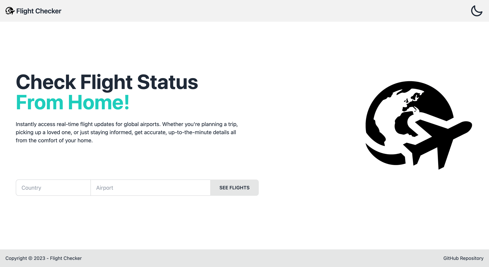
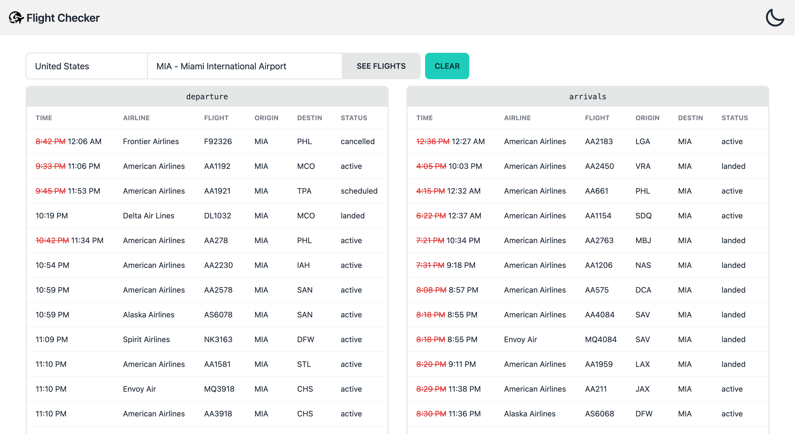
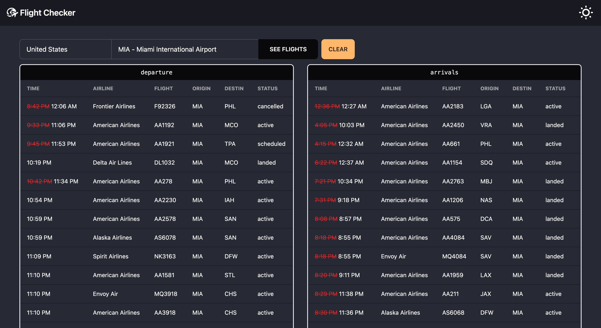
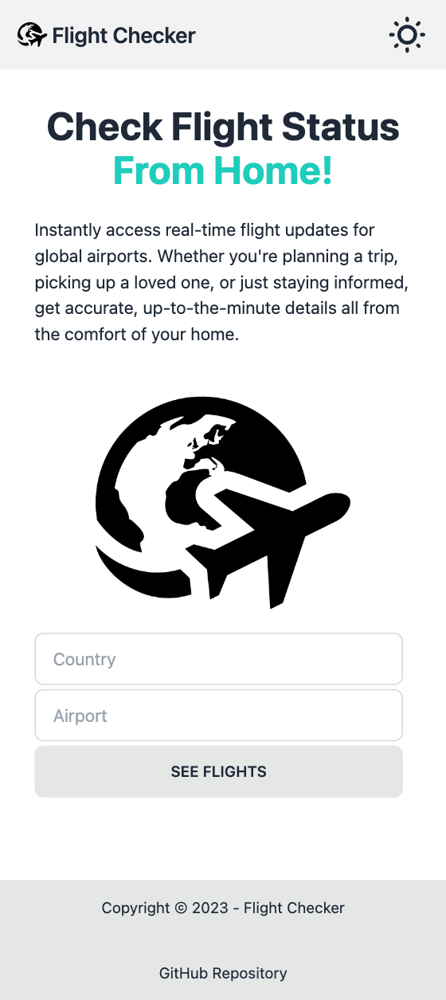
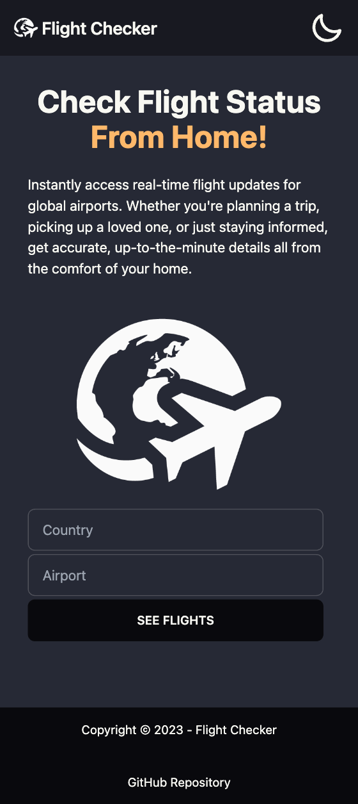

# Flight Checker



## About The Project

Instantly access real-time flight updates for global airports. Whether you're planning a trip, picking up a loved one, or just staying informed, get accurate, up-to-the-minute details all from the comfort of your home.

**Built with:** [Vite](https://vitejs.dev/) • [HTML](https://developer.mozilla.org/en-US/docs/Web/HTML) • [JavaScript](https://www.javascript.com/) • [TailwindCSS](https://tailwindcss.com/) • [DaisyUI](https://daisyui.com/)

### Features

- Country auto complete
- Airport auto complete
- Real-time flight updates
- Flight delay indications
- Dark and Light theme

**Try it →** https://flightchecker.netlify.app

## Getting Started

### Prerequisites

This project was bootstrapped with [Vite](https://github.com/vitejs/vite). Ensure you have Node.js and npm (or any other package manager) installed on your local machine.

### Installation

1. Clone this repo
   ```sh
   git clone https://github.com/fm-anderson/flight-checker.git
   ```
2. Navigate to the project directory
   ```sh
   cd flight-checker
   ```
3. Create a .env file and add your API key from [AirLabs](https://airlabs.co/)

   ```sh
   echo "VITE_API_KEY=paste-api-key-without-quotes-here" > .env
   ```

4. Install dependencies
   ```sh
   npm install
   ```
5. Run the application
   ```sh
   npm run dev
   ```
6. The website should be running on http://localhost:3000

## Contributing

[Git/Github Workflow](https://fm-anderson.notion.site/fm-anderson/GIT-GITHUB-WORKFLOW-36c62b18a2c4439797149d7c79a22d12)

| Contributors     | GitHub                         |
| ---------------- | ------------------------------ |
| Anderson Marques | https://github.com/fm-anderson |
| Anthony Ranieri  | https://github.com/            |
| Dillon Arnold    | https://github.com/Dillona25   |
| Mirko Zlatunic   | https://github.com/            |

Pull requests are welcome. For major changes, please open an issue first to discuss what you would like to change.

## Libraries

| Library       | GitHub                                      |
| ------------- | ------------------------------------------- |
| tailwindcss   | https://github.com/tailwindlabs/tailwindcss |
| daisyui       | https://github.com/saadeghi/daisyui         |
| theme-change  | https://github.com/saadeghi/theme-change    |
| autocompleter | https://github.com/kraaden/autocomplete     |

## API

| API                                         | Solution                         |
| ------------------------------------------- | -------------------------------- |
| [AirLabs](https://airlabs.co/)              | Provides real-time flight status |
| [VatComply](https://vatcomply.com/)         | Provides user geolocation        |
| [RestCountries](https://restcountries.com/) | Provides auto-complete list      |

## Screenshots (Desktop)


---


---



---



---

## Screenshots (Mobile)



---



---
